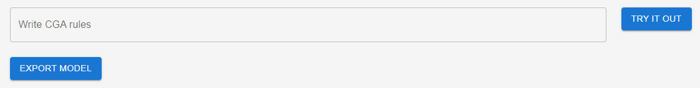
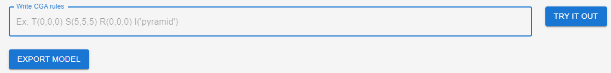
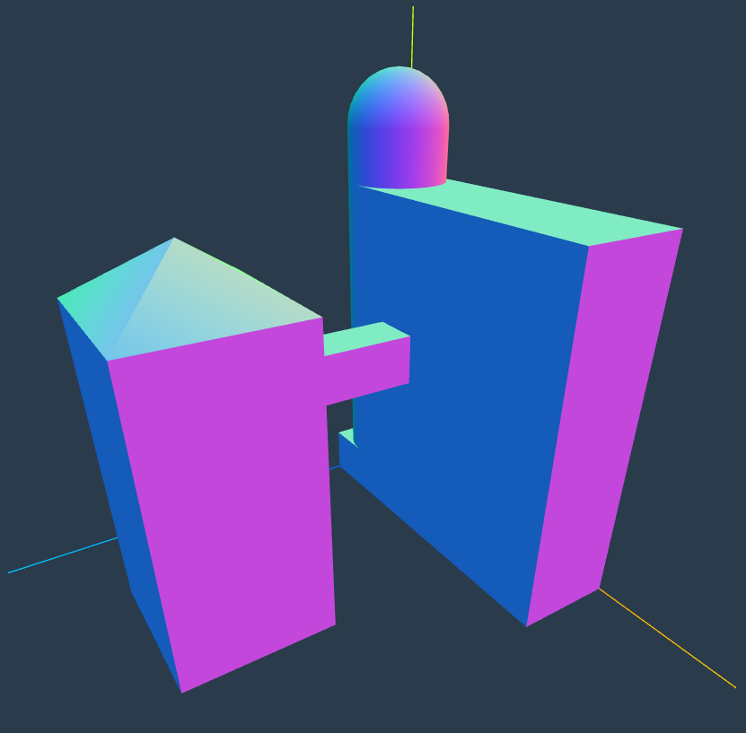
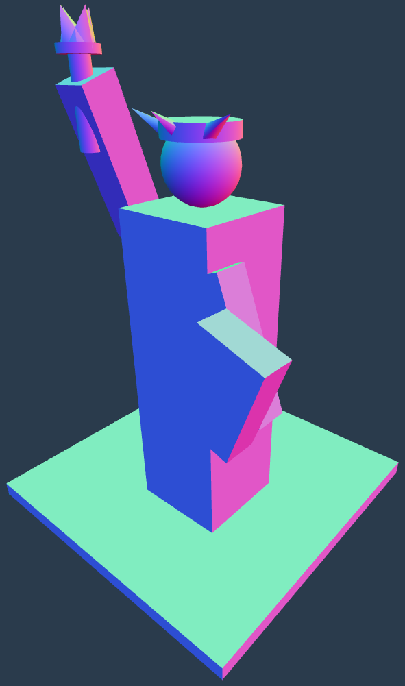

<div align="center">

  <h3 align="center">CGA Procedural Modeling</h3>

  <div align="center">
    A procedural 3D modeling viewer using the "Computer-generated Architecture" programming language in React.
  </div>
  
  <br />

  <div>
    
    
  </div>
</div>


## 📋 <a name="table">Table of Contents</a>
1. 🤖 [Introduction](#introduction)
2. ⚙️ [How to run](#how-to-run)
3. 🚀 [Features](#features)


## <a name="introduction">🤖 Introduction</a>

Developed using Javascript, along with the React library, as part of the Advanced 3D Modeling (A3DM) course. This project's goal is to get some hands-on experience on procedural generation techniques for 3D models.

**Tech Stack**
- React
- Three.js
- React Three Fiber
- React Three Drei
- Material UI (MUI)


## <a name="how-to-run">⚙️ How to run</a>

**Prerequisites**

Make sure you have the following installed on your machine:
- [Node.js](https://nodejs.org/en)
- [npm](https://www.npmjs.com/) (Node Package Manager)

**Installation**

```bash
cd ~/cga-procedural-modeling/ (goto the project folder, enter it)
npm install
```

**Running the project**

```bash
npm start
```

Open [http://localhost:3000](http://localhost:3000) in your browser to view the project.


## <a name="features">🚀 Features</a>

**CGA Syntax**

- Instantiate mesh `I('primitive_mesh')`
- Translate mesh `T(x, y, z)`
- Rotate mesh `R(x, y, z)`
- Scale mesh `S(x, y, z)`

**Primitives**

- Cube `I('cube')`
- Cone `I('cone')`
- Sphere `I('sphere')`
- Cylinder `I('cylinder')`
- Pyramid `I('pyramid')`

**Use**

Each operation is applied to the right-adjacent mesh in the syntax. After declaring the desired syntax in the input text area, you can press the `TRY IT OUT` button to generate the model. You could also download the generated model in a `.ply` format by clicking on the `EXPORT MODEL` button.

 



**Examples**

<details>
<summary><code>Example 1 - Building</code></summary>

```bash
T(1,0,0) R(0,0,0) S(6,7,2) I('cube')
T(0,0,0) R(0,0,0) S(2,1,2) I('cube')
T(0,7,0) R(0,0,0) S(2,2,2) I('sphere')
T(0,0,0) R(0,0,0) S(2,8,2) I('cylinder')
T(2,0,5) R(0,0,0) S(3,6,3) I('cube')
T(2,6,5) R(0,45,0) S(3,1,3) I('pyramid')
T(2,3.5,2) R(0,0,0) S(1,1,3) I('cube')
```
</details>

<details>
<summary><code>Example 2 - Statue</code></summary>

```bash
T(0,0,0) R(0,0,0) S(10,0.5,10) I('cube')
T(4,0,4) R(0,0,0) S(3,10,3) I('cube')
T(3,9,6) R(20,0,0) S(1,4,1) I('cube')
T(3.25,11.3,7) R(0,0,0) S(0.5,2,0.5)I('cylinder')
T(3,13.3,6.75) R(0,0,0) S(1,0.2,1) I('cylinder')
T(3,13.5,7) R(0,0,20) S(0.5,0.7,0.5) I('pyramid')
T(3.55,13.5,7) R(0,0,-20) S(0.5,0.7,0.5) I('pyramid')
T(3.3,13.5,7.25) R(20,0,0) S(0.5,0.7,0.5) I('pyramid')
T(3.3,13.5,6.75) R(-20,0,0) S(0.5,0.7,0.5) I('pyramid')
T(7,5,6) R(0,0,20) S(1,4,1) I('cube') 
T(7,5,7) R(0,0,-20) S(2,3,1) I('cube')
T(4.5,10,4.5) R(0,0,0) S(2,2,2) I('sphere')
T(4.5,11.6,4.5) R(0,0,0) S(2,0.4,2) I('cylinder')
T(4.25,11.5,6) R(30,0,60) S(0.3,1,0.3) I('pyramid')
T(5.375,11.5,6.5) R(60,0,0) S(0.3,1,0.3) I('pyramid')
T(6.5,11.5,6) R(30,0,-60) S(0.3,1,0.3) I('pyramid')
```
</details>


Building   |  Statue of Liberty
:-------------------------:|:-------------------------:
  |  